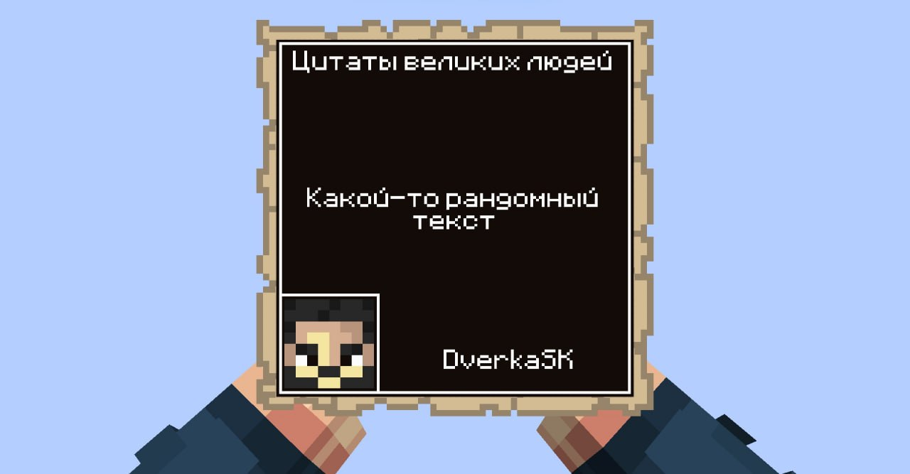

<br>

<h3 align="center">
  Minecraft plugin that allows you to create quotes from players when you click on text in chat.
</h3>

## Usage

To receive a quote, click on the player’s message in the chat, or enter the command manually:
```java
/quote <nickname> <message>
```

## Storage

The plugin has the ability to save quotes in SQLite and Redis, which are configured via config.yml

## Configuration

```yaml
default:
  color:
    # HEX default text color value
    textcolor: "#ffffff"
    # HEX default background color value
    background: "#000000"
    # HEX default stroke color value
    strokecolor: "#ffffff"
  font:
    # Default font name
    # Font must exist in the system
    fontname: "Times New Roman"
    # Default font style
    # 0 - Plain
    # 1 - Bold
    # 2 - Italic
    textstyle: 0
    # Default font size
    fontsize: 12
  quote:
    # Default quote text
    # Will be applied if the command is entered without a message
    # For example '/quote <nickname>'
    text: "Default text"
    # Default title name
    title: "GrandQuotes"
    # Default attribution
    attribution: "Attribution"
database:
  # Quotes will be saved in SQLite if enable = true
  sqlite:
    enable: true
    # Name of database file
    # The database file will be saved in the plugin folder
    path: "test"
  redis:
    # Quotes will be saved in Redis if enable = true
    enable: true
    username: "user"
    password: "password"
    host: "localhost"
    port: 6379
```
